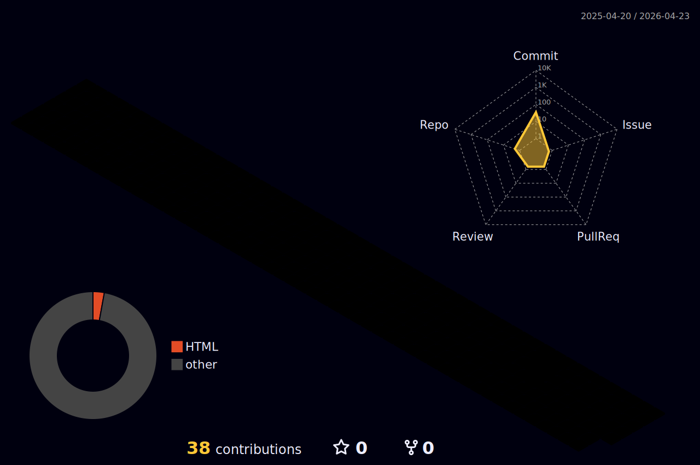

  <!-- HEADER SECTION -->

 
  
  <!-- BENTO GRID LAYOUT START -->
<table width="900" border="0" cellspacing="0" cellpadding="0">
<tr>
      <!-- BOX 1: INTRO & FOCUS (Top Left) -->
<td width="55%" valign="top">
<h3>⚡ The Engineering Philosophy</h3>

Hi, I'm <b>Sameer</b>. I don't just write code; I build digital ecosystems. 
Currently transitioning from traditional MERN to <b>Next-Gen Architectures</b>.

<b>🔭 Current Focus:</b>
 
&nbsp;&nbsp;🔹 Serverless Computing (Next.js 15)
 
&nbsp;&nbsp;🔹 AI Agents & LLM Integration
 
&nbsp;&nbsp;🔹 System Design & Scalability

 

</td>

      <!-- BOX 2: TECH STACK (Top Right) -->
      <td width="45%" valign="top" align="center">
        <h3>🛠️ The Arsenal</h3>
         
        <!-- Clean Modern Icons via SkillIcons -->
        
      </td>
    </tr>
    
    <!-- Spacer Row -->
    <tr><td colspan="2" height="20"></td></tr>

    <tr>
      <!-- BOX 3: GITHUB STATS (Bottom Left) -->
      <td width="55%" valign="top">
        
      </td>

      <!-- BOX 4: CODING HABITS / WAKATIME (Bottom Right) -->
      <td width="45%" valign="top" align="center">
        
      </td>
    </tr>
</table>
  <!-- BENTO GRID LAYOUT END -->

  

  <!-- 3D CITY CONTRIBUTION GRAPH (Optional - Requires Setup) -->
  <!-- Note: Isko chalane ke liye aapko 'github-profile-3d-contrib' action set karna parega. 
       Filhal yeh image placeholder hai taaky aap look check kar sakein. 
       Jab action set karein to neeche wali line uncomment karein aur image link change karein. -->
  

 

<!-- FOOTER / CONTACT -->

&nbsp;&nbsp;

&nbsp;&nbsp;

